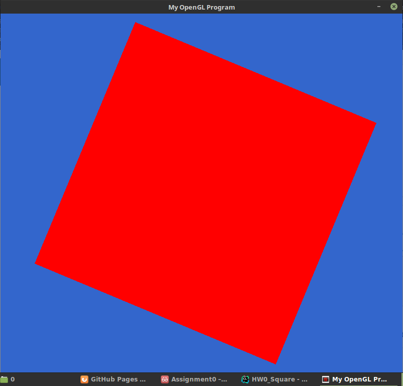

# SquareGL


### Features -

- **Smooth Translation** - Click the mouse _inside_ the square and drag.
- **Scaling** - Click the mouse near the _edges_ and drag.
- **Rotation** - Click the mouse near the _corners_ and drag.

### Challenges - 
> **Problem** - Setting up OpenGL and SDL to work with my project in CLion on Linux Mint 18.2 Sonya.
>
> **Solution** -
> - First I had to install SDL. OpenGL was already installed on my system. libsdl2-dev wasn't easy to install via apt-get
  due to some broken packages present on my system as opposed to the versions of those packages that it needed.
  I fixed this by using the aptitude package manager to resolve the conflicts.
>
> - Since CLion's project model is based on CMake, I had to figure out a way to use SDL and OpenGL with CMake.
  After some digging online, I was able to figure out how to create the CMakeLists file, setting the linker flags as required and got it working as expected.

:arrow_down: Download [Repository Zip](http://github.com/debowin/opengl-square/zipball/master/) :arrow_down:
## Welcome to GitHub Pages

You can use the [editor on GitHub](https://github.com/debowin/opengl-square/edit/master/README.md) to maintain and preview the content for your website in Markdown files.

Whenever you commit to this repository, GitHub Pages will run [Jekyll](https://jekyllrb.com/) to rebuild the pages in your site, from the content in your Markdown files.

### Markdown

Markdown is a lightweight and easy-to-use syntax for styling your writing. It includes conventions for

```markdown
Syntax highlighted code block

# Header 1
## Header 2
### Header 3

- Bulleted
- List

1. Numbered
2. List

**Bold** and _Italic_ and `Code` text

[Link](url) and 
```

For more details see [GitHub Flavored Markdown](https://guides.github.com/features/mastering-markdown/).

### Jekyll Themes

Your Pages site will use the layout and styles from the Jekyll theme you have selected in your [repository settings](https://github.com/debowin/opengl-square/settings). The name of this theme is saved in the Jekyll `_config.yml` configuration file.

### Support or Contact

Having trouble with Pages? Check out our [documentation](https://help.github.com/categories/github-pages-basics/) or [contact support](https://github.com/contact) and we’ll help you sort it out.
